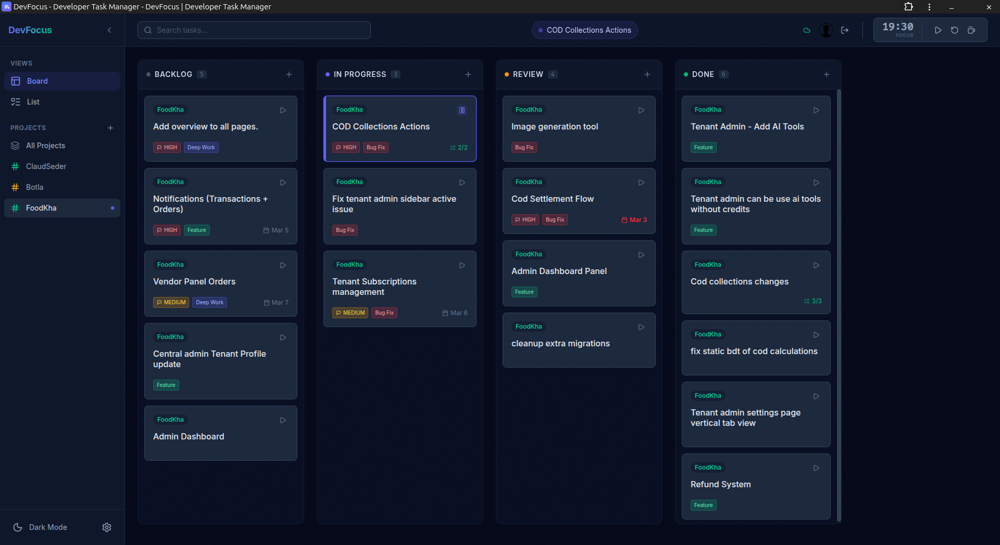
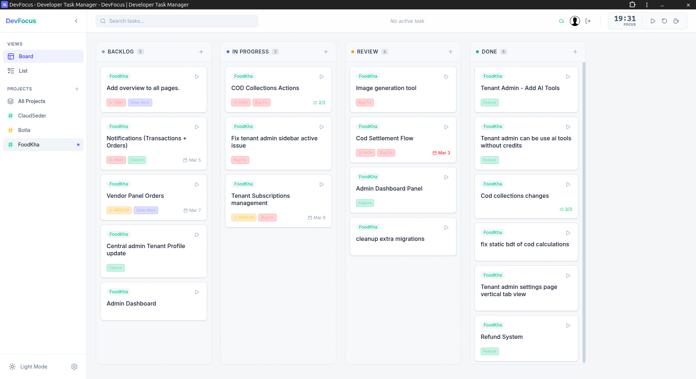
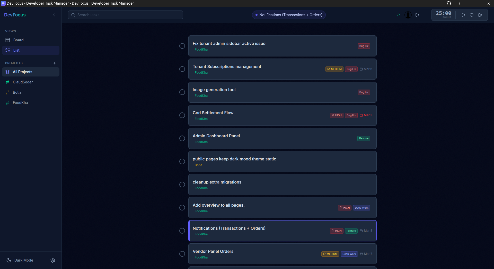
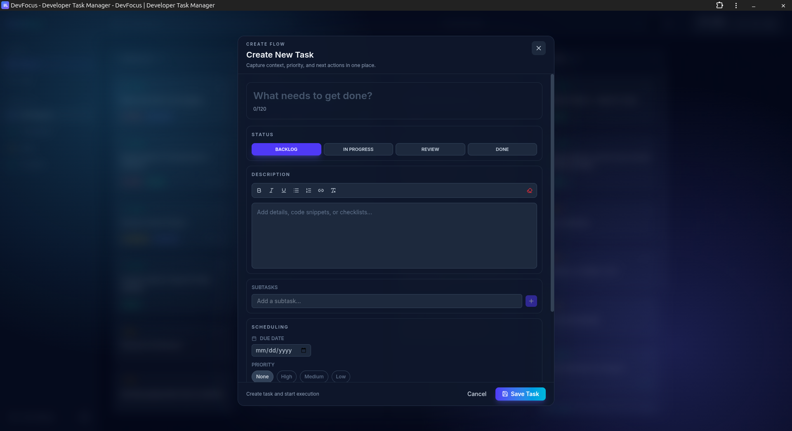

<div align="center">

# 🎯 DevFocus

**A productivity-focused task manager built for developers**

[](LICENSE.md)
[](https://react.dev/)
[](https://www.typescriptlang.org/)
[](https://vitejs.dev/)
[](https://tailwindcss.com/)

[🚀 Live Demo](https://todo.emon.bd) • [📖 Documentation](#documentation) • [🤝 Contributing](CONTRIBUTING.md)

</div>

---

## 📸 Screenshots

<div align="center">

### Dashboard

| Dark Mode | Light Mode |
|:---------:|:----------:|
|  |  |

### Task Management

| Task List | Add Task |
|:---------:|:--------:|
|  |  |

</div>

---

## ✨ Features

<table>
<tr>
<td width="50%">

### 🎨 **Modern UI**
- Sleek dark-mode interface
- Responsive design for all devices
- Smooth animations with Framer Motion
- PWA ready — install as native app

### 📋 **Task Management**
- **Dual Views**: Kanban board & list view
- **Drag & Drop**: Reorder tasks easily
- **Subtasks**: Break down complex work
- **Keyboard Shortcuts**: Press `n` to create tasks

</td>
<td width="50%">

### 🏷️ **Organization**
- Custom tags & priority levels
- Due dates & deadline tracking
- Markdown support for rich descriptions
- Search and filter capabilities

### ☁️ **Sync & Offline**
- **Local-First**: Works offline with IndexedDB
- **Cloud Sync**: Firebase when online
- Google Authentication
- Real-time data synchronization

</td>
</tr>
</table>

## 🚀 Quick Start

```bash
# Clone the repository
git clone https://github.com/yourusername/dev-focus.git
cd dev-focus

# Install dependencies
npm install

# Configure environment
cp .env.example .env.local

# Start development server
npm run dev
```

Open [http://localhost:5173](http://localhost:5173) in your browser.

## 🛠️ Tech Stack

<div align="center">

| Category | Technologies |
|----------|-------------|
| **Frontend** | React 19 • TypeScript • Vite |
| **Styling** | Tailwind CSS 4 • Framer Motion |
| **State** | React Context • Custom Hooks |
| **Backend** | Firebase Auth • Firestore |
| **Storage** | IndexedDB (local) • Firebase (cloud) |
| **Testing** | Vitest • React Testing Library |

</div>

## 📚 Documentation

### Prerequisites

- [Node.js](https://nodejs.org/) 18+
- [Firebase](https://firebase.google.com/) project (free tier)

### Firebase Setup

1. Go to [Firebase Console](https://console.firebase.google.com/)
2. Create a new project
3. Enable **Authentication** → Google sign-in provider
4. Create a **Web App** → copy config values
5. Paste values into `.env.local`

### Available Scripts

| Command | Description |
|---------|-------------|
| `npm run dev` | Start development server |
| `npm run build` | Build for production |
| `npm run preview` | Preview production build |
| `npm run lint` | Run ESLint |
| `npm run lint:fix` | Fix ESLint issues |
| `npm run test` | Run tests |
| `npm run test:watch` | Run tests in watch mode |

## 📁 Project Structure

```
dev-focus/
├── 📂 components/       # React components
├── 📂 context/          # State management
├── 📂 hooks/            # Custom React hooks
├── 📂 services/         # Firebase & storage
├── 📂 utils/            # Helper functions
├── 📂 plans/            # Documentation
├── 📄 App.tsx           # Root component
├── 📄 types.ts          # TypeScript types
└── 📄 vite.config.ts    # Build configuration
```

## 🤝 Contributing

We welcome contributions! Please read our [Contributing Guide](CONTRIBUTING.md) to learn about:

- Setting up your development environment
- Coding standards and best practices
- Submitting pull requests
- Reporting bugs and requesting features

## 📄 License

This project is licensed under the **MIT License** — see [LICENSE.md](LICENSE.md) for details.

---

<div align="center">

Made with ❤️ by the DevFocus community

[⭐ Star this repo](https://github.com/yourusername/dev-focus) • [🐛 Report Bug](../../issues) • [💡 Request Feature](../../issues)

</div>